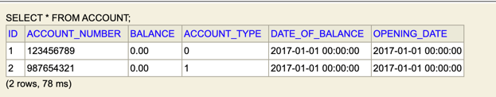
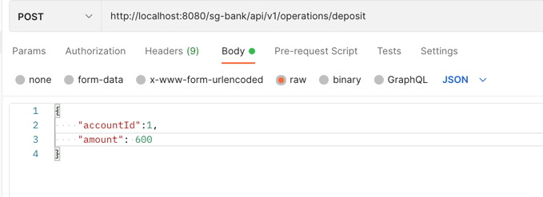
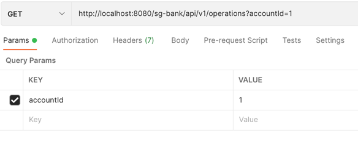

# Bank account kata
 Think of your personal bank account experience When in doubt, go for the simplest solution

 Subject Link https://gist.github.com/abachar/d20bdcd07dac589feef8ef21b487648c

# Bank account kata Solution Proposition

## Quick Start

### dependencies

* [java](https://java.com/fr/download/help/download_options.html) (v11)
* Spring Boot v:2.6.7

### Start the project

```shell
mvn spring-boot:run
```
* the application is accessible at http://localhost:8080/sg-bank/api/v1/


### Database
* For database i use in-memory h2 database available at http://localhost:8080/sg-bank/api/v1/h2 after project start
* username: sg-kata
* password: bank-kata
* database: bank

In the db we have 2 Accounts with id 1 and 2 et no operation



### Api documentation

* The api documentation is available here http://localhost:8080/sg-bank/api/v1/swagger-ui/ at application start up


### Query the api


* Make a deposit



* Make a withdraw


* Get operations by Account




### Run the tests

```shell
`mvn test`  from the root directory
```

### improvements

* Add more tests
* Add integration test with testContainer
* Error handling properly
* add docker for application start up


